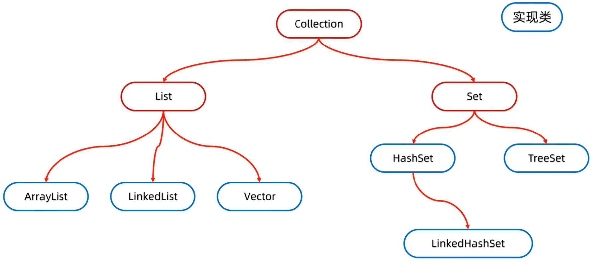
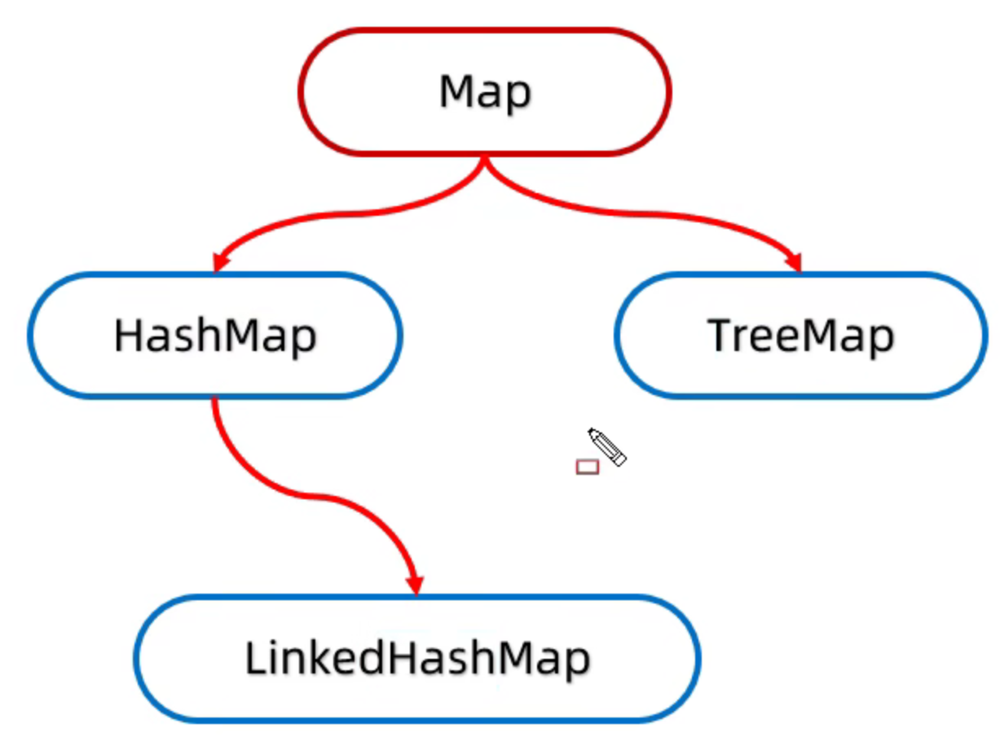
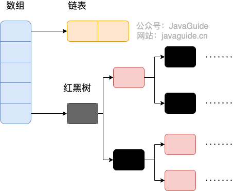

# 集合

---

## 分类/结构

#### 




## ArrayList

### 为什么建议指定初始化容量？

- 避免扩容降低性能，造成内存浪费；

### 如何扩容？

- 何时扩容？当前元素数量`size`达到数组容量`length`时扩容；
- 如何扩容？创建新数组，复制旧数据到新数组；
- 扩多大？基于内存使用与性能之间的权衡，默认扩容因子为1.5倍；

### 线程安全吗？

- 回答：线程不安全
- 解决：
  - synchronized 包裹代码块进行操作
  - CopyOnWriteArrayList

## CopyOnWriteArrayList

- 原理：
  - 基于数组实现；
  - 读写分离：添加元素时会复制一个新数组，写操作时会在新数组进行，读操作在原数组进行；
  - 写操作加锁，防止并发覆盖问题；
  - 写操作结束后，原数组会指向新数组；
- 特点：
  - 读多写少
  - 实时性差
  - 无初始容量，因为底层是定长数组
- `add` 流程（简化版源码），`remove`同理：

```java
public boolean add(E e) {
    final ReentrantLock lock = this.lock;
    lock.lock();  // 1. 加锁（保证线程安全）
    try {
        Object[] elements = getArray();      // 2. 获取当前数组
        int len = elements.length;
        Object[] newElements = Arrays.copyOf(elements, len + 1);  // 3. 复制新数组（长度+1）
        newElements[len] = e;                // 4. 新元素放入末尾
        setArray(newElements);                 // 5. 替换引用（volatile保证可见性）
        return true;
    } finally {
        lock.unlock();  // 6. 解锁
    }
}
```

## HashMap

### 底层结构

- JDK1.7：数组+链表


- JDK1.8+：数组+链表+红黑树



### Hash

- JDK1.4：开始加入哈希扰动，高位参与 hash 计算
- JDK1.8：

```java
    static final int hash(Object key) {
      int h;
      // key.hashCode()：返回散列值也就是hashcode
      // ^：按位异或
      // >>>:无符号右移，忽略符号位，空位都以0补齐
      return (key == null) ? 0 : (h = key.hashCode()) ^ (h >>> 16);
  }
```

### 初始化 new HashMap<>(10, 0.75)

- JDK7：直接创建  `table.length = 16` ，` threshold = 12`
- JDK8+：延迟初始化！ `table = null `， `threshold = 16 `（存的是容量，不再是阈值）
- 延迟初始化放在了 `resize`中，第一次`put`时创建 `threshold * loadFactor`大小的数组（记得2幂次方对齐）

### 添加元素 map.put

- `(table.length-1) & hash()`，得到数组下标
- 如果桶内（即下标位置）为 null，直接添加元素入数组
- 如果桶内不为 null，遍历链表/红黑树，equals比较key
  - 如果 key 一致，覆盖 Entry 对象的 value
  - 遍历完无对应 key，JDK7 头插，JDK8+ 尾插 / 红黑树插入

- JDK8+ 树化：
  - 插入后 链表长度 >= 8，考虑树化
  - 检查 数组长度 >= 64，开始树化
  - 检查数组长度 < 64，resize 扩容

### loadFactor 负载因子

- 0.75 是空间利用率与查询性能的经验权衡值
- 基于泊松分布分析，`loadFactor = 0.75` 时，桶的平均长度约 0.5，绝大多数桶无冲突或仅单个元素，在控制内存占用（不频繁扩容）的同时保证 O(1) 查询效率

### 如何扩容？

- 为什么2倍扩容？插入公式为 `(table.length-1) & hash()`，数组为2的幂次方时，`table.length-1`为2的全1二进制，结果完全取决于`hash()`，如此设计可以降低Hash冲突概率，提高查询效率，所以其实**实际的 `table.length`也是2的幂次方，然后每次2倍扩容**

- 流程：
  - JDK7：**重哈希**，遍历所有节点，重新计算`hash`和桶位置，然后依次插入到新数组（**头插法导致扩容时并发线程易导致死循环问题**）
  - JDK8：**高低位链表**，尾插法不再需要考虑重新插入的问题（因为原序不变），判断  `hash & oldCap`  是否为 0，决定新位置：
    - `hash` 的第 n 位是 0，则该节点放入低位链表，即 `hash & oldCap = 0`，位置不变
    - `hash` 的第 n 位是 1，则该节点放入高位链表，即`hash & oldCap != 0`，`位置 = 原索引 + oldCap`
    - 链表所有节点都放入高低位链表后，再整体挂到对应位置，即 原位置 `原索引` 和 新位置 `原索引 + oldCap`

### 线程安全吗？

- JDK7：并发，先后扩容引起的**环形链**问题 /  同时扩容引起的**数据覆盖丢失**问题

- JDK8：并发，尾插法解决了环形链问题，同时扩容 仍会**数据覆盖丢失**，源于table和size的无锁

## ConcurrentHashMap

### 底层结构

JDK7（Segment + HashMap）：


JDK8（Node + 链表/红黑树）：


---

### JDK8 核心流程

**锁粒度细化到桶头**（去除 Segment）、**CAS 无锁化**快速路径、链表过长转**红黑树**。用 **CAS + synchronized** 替代 ReentrantLock（可重入锁），实现更高的并发性能。

> | 特性         | CAS                    | synchronized                    | ReentrantLock                            |
> | ------------ | ---------------------- | ------------------------------- | ---------------------------------------- |
> | **本质**     | CPU 原子指令（乐观锁） | JVM 内置监视器锁（悲观锁）      | API 层面的显式锁（悲观锁）               |
> | **控制方式** | 无锁，自动重试         | 隐式，JVM 自动管理              | 显式，`lock()`/`unlock()` 手动控制       |
> | **灵活性**   | 低，只能操作单个变量   | 低，代码块级别                  | **高**，可中断、超时、公平锁、多条件变量 |
> | **性能**     | 无竞争时最优           | JDK 6+ 优化后接近 ReentrantLock | 与 synchronized 差不多，略慢             |
> | **典型使用** | 计数器、简单 CAS 操作  | 通用同步代码块                  | 需要超时/中断/公平性的复杂场景           |
>
> **一句话总结**：
>
> - **CAS**：无锁碰碰运气，适合简单原子操作
> - **synchronized**：自动加锁释放，够用且省心
> - **ReentrantLock**：手动精细控制，功能更丰富但代码更繁琐
>
> CAS 在应用层通常靠自旋（循环重试）来实现，直到成功为止。
>
> ```java
> public final int getAndAddInt(Object o, long offset, int delta) {
>     int v;  // 🔥 局部变量，存在线程栈里，每个线程有自己的 v
>     do {
>         v = getIntVolatile(o, offset);  // 关键：volatile 读，保证看到最新值
>     } while (!compareAndSwapInt(o, offset, v, v + delta));  // CAS 原子比较并替换
>     return v;
> }
> ```
>
> 

| 场景             | 处理方式                  | 技术             |
| ---------------- | ------------------------- | ---------------- |
| 数组为空         | 初始化数组                | **CAS**          |
| 桶为空（无冲突） | 直接插入头节点            | **CAS**          |
| 桶有数据（冲突） | 锁住桶头节点，链表/树操作 | **synchronized** |

---

### 源码解析

```java
final V putVal(K key, V value, boolean onlyIfAbsent) {
    if (key == null || value == null) throw new NullPointerException();
    int hash = spread(key.hashCode());
    int binCount = 0;
    
    for (Node<K,V>[] tab = table;;) {
        Node<K,V> f; int n, i, fh;
        
        // 1. 数组为空：CAS 初始化
        if (tab == null || (n = tab.length) == 0)
            tab = initTable();
        
        // 2. 桶为空：CAS 无锁插入（快速路径）
        else if ((f = tabAt(tab, i = (n - 1) & hash)) == null) {
            if (casTabAt(tab, i, null, new Node<K,V>(hash, key, value, null)))
                break;  // 插入成功，跳出循环
        }
        
        // 3. 正在扩容：协助迁移
        else if ((fh = f.hash) == MOVED)
            tab = helpTransfer(tab, f);
        
        // 4. 桶有数据：synchronized 锁住头节点（细粒度锁）
        else {
            V oldVal = null;
            synchronized (f) {  // 🔥 锁粒度细化到单个桶的头节点
                if (tabAt(tab, i) == f) {  // 再次确认头节点未变
                    
                    // 4.1 链表处理
                    if (fh >= 0) {
                        binCount = 1;
                        for (Node<K,V> e = f;; ++binCount) {
                            K ek;
                            // 找到相同key，替换value
                            if (e.hash == hash && ((ek = e.key) == key || (ek != null && key.equals(ek)))) {
                                oldVal = e.val;
                                if (!onlyIfAbsent)
                                    e.val = value;
                                break;
                            }
                            Node<K,V> pred = e;
                            // 遍历到末尾，新增节点
                            if ((e = e.next) == null) {
                                pred.next = new Node<K,V>(hash, key, value, null);
                                break;
                            }
                        }
                    }
                    
                    // 4.2 红黑树处理
                    else if (f instanceof TreeBin) {
                        Node<K,V> p;
                        binCount = 2;
                        if ((p = ((TreeBin<K,V>)f).putTreeVal(hash, key, value)) != null) {
                            oldVal = p.val;
                            if (!onlyIfAbsent)
                                p.val = value;
                        }
                    }
                }
            }
            
            // 5. 检查是否需要转红黑树（链表长度>=8）
            if (binCount != 0) {
                if (binCount >= TREEIFY_THRESHOLD)
                    treeifyBin(tab, i);  // 链表转红黑树
                if (oldVal != null)
                    return oldVal;
                break;
            }
        }
    }
    addCount(1L, binCount);  // CAS 更新元素计数
    return null;
}
```

### 为什么不全用CAS，或 synchronized？

我们可以看不同的方式中做的事情是什么：

- CAS保证线程安全时，它做的事情是初始化数组或者初始化头节点
- synchronized 保证线程安全时，它做的事情是遍历桶下的结点，比较key是否相等，然后再插入元素或者替换元素，再判断链表是否转为红黑树

所以可以看出是后者耗时更长

- **CAS无锁就适合做短时间的任务**，因为如果任务执行时间长，就会有线程不断的**自旋尝试，过度占用CPU**
- **synchronized就适合做长时间、高竞争的任务**，加锁后，其余线程会进入**休眠，不会占用CPU**
- 这是两者的特点不同，适用的场景不同。

这种设计体现了对 **不同场景的精细化控制**，是现代并发编程中“**无锁优先，锁为补充**”思想的典型实践。

