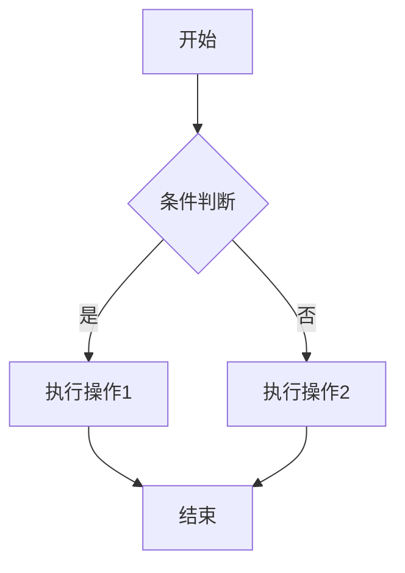

# {{技术主题}}

> 📅 创建日期：{{date}}
> 🔄 最后更新：{{date}}
> 📂 分类：{{category}}
> 🏷️ 标签：{{tag1}}, {{tag2}}, {{tag3}}
> ⭐ 重要程度：⭐⭐⭐⭐⭐

---

## 1. 问题/知识点概述

### 1.1 背景

<!-- 描述这个问题的背景，为什么会出现，实际应用场景 -->

{{背景描述}}

### 1.2 核心概念

<!-- 定义核心概念，使用简洁的语言 -->

- **{{概念1}}**：{{定义}}
- **{{概念2}}**：{{定义}}

### 1.3 适用场景

- ✅ 适用：{{场景1}}
- ❌ 不适用：{{场景2}}

---

## 2. 详细内容

### 2.1 原理剖析

<!-- 深入讲解原理，可以配合图示 -->

{{详细原理解释}}

```
# 可以用文本图或代码说明
+-------------+      +-------------+      +-------------+
|   组件 A     |----->|   组件 B     |----->|   组件 C     |
+-------------+      +-------------+      +-------------+
```

### 2.2 代码示例

#### 示例 1：{{示例描述}}

```java
// 代码注释要详细，说明每一步在做什么
public class Example {
    public void demo() {
        // 关键步骤 1
        step1();
        
        // 关键步骤 2
        step2();
    }
}
```

**关键点说明：**
1. {{关键点1}} - 为什么这样做
2. {{关键点2}} - 注意事项

#### 示例 2：{{示例描述}}

```python
# Python 示例
def example():
    pass
```

### 2.3 流程图

<!-- 如果有复杂流程，用 Mermaid 语法绘制 -->



---

## 3. 常见问题与解决方案

### 3.1 问题 1：{{问题描述}}

**现象：** {{具体表现}}

**原因：** {{根本原因}}

**解决方案：**

```java
// 修复后的代码
```

**预防措施：**
- {{措施1}}
- {{措施2}}

### 3.2 问题 2：{{问题描述}}

**现象：**

**原因：**

**解决方案：**

---

## 4. 对比与选型

### 4.1 与其他方案对比

| 特性 | 方案 A | 方案 B | 方案 C |
|:---:|:---:|:---:|:---:|
| 性能 | ⭐⭐⭐ | ⭐⭐ | ⭐⭐⭐⭐ |
| 易用性 | ⭐⭐ | ⭐⭐⭐⭐ | ⭐⭐⭐ |
| 适用场景 | {{场景}} | {{场景}} | {{场景}} |

### 4.2 选型建议

- **选择 A**：{{适用情况}}
- **选择 B**：{{适用情况}}

---

## 5. 最佳实践

### 5.1 Do's ✅

1. {{推荐做法1}}
2. {{推荐做法2}}
3. {{推荐做法3}}

### 5.2 Don'ts ❌

1. {{避免做法1}}
2. {{避免做法2}}
3. {{避免做法3}}

---

## 6. 源码分析（可选）

<!-- 如果是开源框架，可以分析源码 -->

### 6.1 关键源码位置

- 类：`{{package.ClassName}}`
- 方法：`{{methodName}}`

### 6.2 源码解读

```java
// 源码关键部分
```

---

## 7. 相关资料

### 7.1 参考来源

- 📖 **官方文档**：{{链接}}
- 📝 **博客文章**：{{标题}} - {{链接}}
- 📺 **视频教程**：{{标题}} - {{链接}}
- 💬 **讨论/问答**：{{来源}} - {{链接}}

### 7.2 相关笔记

- [{{相关笔记1}}](./{{file}}.md)
- [{{相关笔记2}}](./{{file}}.md)

### 7.3 面试题引用

- [{{面经记录}}](../interviews/{{file}}.md#相关题号)

---

## 8. 个人总结

<!-- 记录自己的理解、易错点、记忆技巧 -->

### 8.1 核心要点回顾

1. {{要点1}}
2. {{要点2}}
3. {{要点3}}

### 8.2 记忆技巧

{{如何记忆这个知识点}}

### 8.3 后续待深入

- [ ] {{待学习内容1}}
- [ ] {{待学习内容2}}

---

> 💡 **更新日志**
> - {{date}}: 创建笔记，完成基础内容
> - {{date}}: 补充{{内容}}
